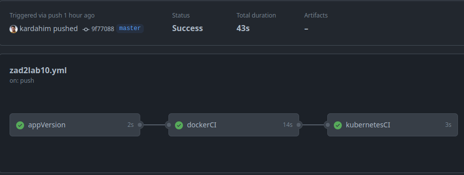
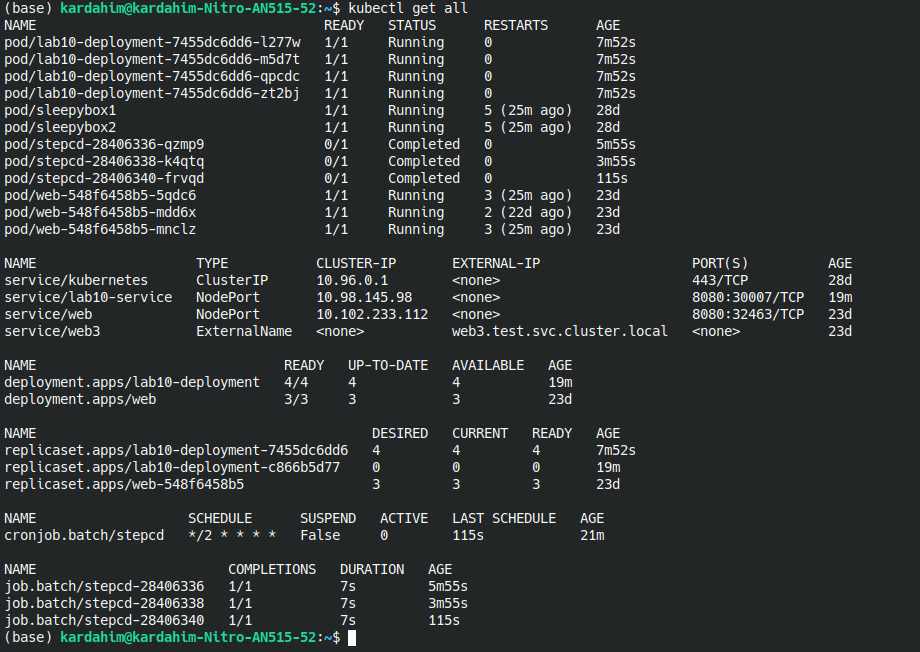
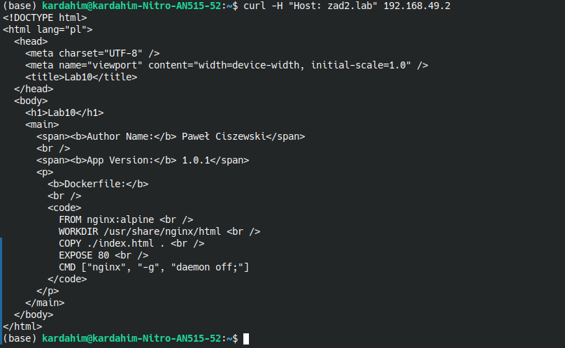
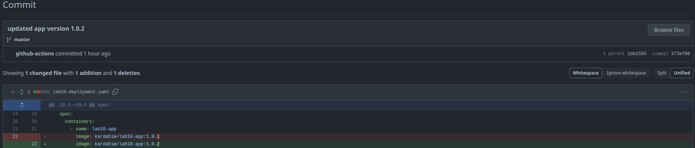
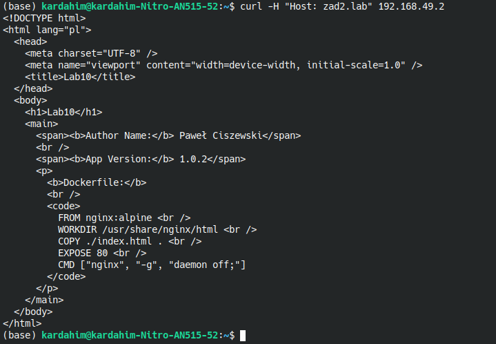

# Repozytoria

W celu wykonania zadania uzywam 2 innychr epozytoriów:

- [lab10_source](https://github.com/kardahim/lab10_source)
- [lab10_config](https://github.com/kardahim/lab10_config)

# Part 1

W ramach tej częsci stworzymy repozytorium source oraz config. Source będzie zawierać plik _Dockerfile_ niezbędny do wdrożenia strony _index.html_. Config będzie zawierać manifesty niezbędne do wdrożenia tego na system kubernetes.

## Zawartość lab10_source

Lab10_source zawiera statyczną stronę html z informacjami o autorze, wersji aplikacji oraz o pliku Dockerfile.

```html
<!DOCTYPE html>
<html lang="pl">
  <head>
    <meta charset="UTF-8" />
    <meta name="viewport" content="width=device-width, initial-scale=1.0" />
    <title>Lab10</title>
  </head>
  <body>
    <h1>Lab10</h1>
    <main>
      <span><b>Author Name:</b> Paweł Ciszewski</span>
      <br />
      <span><b>App Version:</b> 1.0.2</span>
      <p>
        <b>Dockerfile:</b>
        <br />
        <code>
          FROM nginx:alpine <br />
          WORKDIR /usr/share/nginx/html <br />
          COPY ./index.html . <br />
          EXPOSE 80 <br />
          CMD ["nginx", "-g", "daemon off;"]
        </code>
      </p>
    </main>
  </body>
</html>
```

```dockerfile
FROM nginx:alpine
WORKDIR /usr/share/nginx/html
COPY ./index.html .
EXPOSE 80
CMD ["nginx", "-g", "daemon off;"]
```

## Zawartość lab10_config

Repozytorium to zawiera manifesty pozwalające na stworzenie:

- deloyment
- service
- ingress

Deployment (korzysta z obrazu z dockerhuba)

```yaml
apiVersion: apps/v1
kind: Deployment
metadata:
  name: lab10-deployment
spec:
  replicas: 4
  selector:
    matchLabels:
      app: lab10-app
  strategy:
    type: RollingUpdate
    rollingUpdate:
      maxSurge: 5
      maxUnavailable: 2
  template:
    metadata:
      labels:
        app: lab10-app
    spec:
      containers:
        - name: lab10-app
          image: kardahim/lab10-app:1.0.2
```

Service

```yaml
apiVersion: v1
kind: Service
metadata:
  name: lab10-service
spec:
  type: NodePort
  ports:
    - port: 8080
      targetPort: 80
      nodePort: 30007
  selector:
    app: lab10-app
```

Ingress

```yaml
apiVersion: networking.k8s.io/v1
kind: Ingress
metadata:
  name: lab10-ingress
spec:
  rules:
    - host: zad2.lab
      http:
        paths:
          - pathType: Prefix
            path: "/"
            backend:
              service:
                name: lab10-service
                port:
                  number: 8080
```

# Part 2

W ramach tej częsci stworzony zostanie _workflow_ który pozwoli na:

- zbudowanie obrazu dla wybranych architektur sprzętowych
- nadanie tag-u i przesłanie obrazu do swojego repozytorium na DockerHub
- modyfikację manifestów yaml na repozytorium Config repo

```yaml
name: Docker

on:
  push:
    branches: ["master"]
  pull_request:
    branches: ["master"]

jobs:
  appVersion:
    runs-on: ubuntu-latest
    outputs:
      version_number: ${{ steps.vars.outputs.version_number }}
    steps:
      - name: Check out the repo
        uses: actions/checkout@v4
      - name: set-output
        id: vars
        run: |
          version_number=$(sed -n 's/.*<b>App Version:<\/b> \(.*\)<\/span>.*/\1/p' index.html)
          echo "version_number=${version_number}" >> "$GITHUB_OUTPUT"
        shell: bash

  dockerCI:
    needs: appVersion
    runs-on: ubuntu-latest
    steps:
      - name: Check out the repo
        uses: actions/checkout@v4
      - name: Set up QEMU
        uses: docker/setup-qemu-action@v3
      - name: Set up Docker Buildx
        uses: docker/setup-buildx-action@v3
      - name: Login to Docker Hub
        uses: docker/login-action@v3
        with:
          username: ${{ secrets.DOCKER_HUB_LOGIN }}
          password: ${{ secrets.DOCKER_HUB_PASSWORD }}
      - name: Build and push
        uses: docker/build-push-action@v5
        with:
          context: .
          push: true
          tags: kardahim/lab10-app:${{ needs.appVersion.outputs.version_number}}

  kubernetesCI:
    needs: [appVersion, dockerCI]
    runs-on: ubuntu-latest
    steps:
      - name: Check out the repo
        uses: actions/checkout@v4
        with:
          repository: kardahim/lab10_config
          token: ${{ secrets.ACTIONS_TOKEN }}
      - run: |
          sed -i 's/kardahim\/lab10-app:.*/kardahim\/lab10-app:${{ needs.appVersion.outputs.version_number }}/g' lab10-deployment.yaml
          git config user.name github-actions
          git config user.email github-actions@github.com
          git add -u
          git commit -m "updated app version ${{ needs.appVersion.outputs.version_number }}"
          git push
```



_appVersion_ odpowiedzialny jest za ustalenie wersji aplikacji. _dockerCI_ buduje obraz oraz przesyła go na platforme DockerHub. Natomiast _kubernetesCI_ modyfikuje manifesty.

# Part 3

W tej częsci stworzony zostanie system, który będzie odpowiadał za aktualizację aplikacji. Za każdym razem jak zmieni się kod źródłowy dzięki workflow zostaną zamienione manifesty natomiast dzięki stworzonemu _cronjob_ co 2 minuty będą one kopiowanie i urychamiane w kontenerze.

Ta częśc wymaga stworzenia konta _gitops_.

```bash
kubectl create sa gitops
kubectl create clusterrolebinding gitops-admin --clusterrole=cluster-admin --serviceaccount default:gitops
```

Dockerfile

```dockerfile
FROM alpine:latest
RUN apk update && \
    apk add --no-cache git curl && \
    apk add --no-cache --repository=http://dl-cdn.alpinelinux.org/alpine/edge/community kubectl
CMD ["/bin/sh"]
```

```bash
docker build -t kardahim/lab10gitops .
docker push kardahim/lab10gitops:latest
```

CronJob

```yaml
apiVersion: batch/v1
kind: CronJob
metadata:
  name: stepcd
spec:
  schedule: "*/2 * * * *"
  concurrencyPolicy: Forbid
  jobTemplate:
    spec:
      backoffLimit: 0
      template:
        spec:
          restartPolicy: Never
          serviceAccountName: gitops
          containers:
            - name: zad2gitops
              image: kardahim/lab10gitops
              command: [sh, -e, -c]
              args:
                - git clone https://github.com/kardahim/lab10_config.git /tmp/lab10_config && find /tmp/lab10_config -name '*.yaml' -exec kubectl apply -f {} \;
```

```bash
kubectl apply -f operator-stepcd.yaml
```

# Part 4

Ta część weryfikuje działanie całego systemu.

W celu sprawdzenia stworzonych elementów używam polecenia

```bash
kubectl get all
```



Możemy zobaczyć stworzone pody lab10-deployment, pody odpowiedzialne za operator stepcd oraz odpowiednie serwisy, replikasety, joby.

Obecna wersja aplikacji to 1.0.1 zobaczmy czy serwis działa.



Teraz zmienimy wersję aplikacji oraz wyślemy zmiany na repozytorium _lab10_source_.



Jak możemy zobaczyć automatycznie zastąpiono wersje w manifeście deploymentu przez github-actions.

Sprawdźmy zawartość serwisu po zmianach.


Jak możemy zaobserwować zmiany zostały autoamtycznie wprowadzone.
