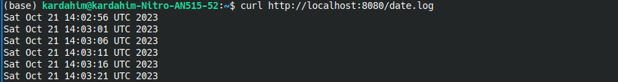

# Plik sidecar-pod

Plik _sidecar-pod.yml_ zawiera konfigurację potrzebną do stworzenia poda z dwoma kontenerami typu _sidecar_.

```yml
apiVersion: v1
kind: Pod
metadata:
  creationTimestamp: null
  labels:
    run: sidecar-pod
  name: sidecar-pod
  namespace: lab3
spec:
  containers:
    - image: busybox
      name: busybox-container
      resources: {}
      command:
        - "sh"
        - "-c"
        - "while true; do date >> /var/log/date.log; sleep 5; done"
      volumeMounts:
        - name: logs
          mountPath: /var/log
    - image: nginx
      name: nginx-container
      ports:
        - containerPort: 80
      volumeMounts:
        - name: logs
          mountPath: /usr/share/nginx/html
  dnsPolicy: ClusterFirst
  restartPolicy: Always
  volumes:
    - name: logs
      emptyDir: {}
status: {}
```

# Stworzenie poda

Konfiguracja poda _sidecar-pod_ wymaga posiadania przestrzeni nazw _lab3_.

```bash
kubectl create namespace lab3
```

Stworzenie poda:

```bash
kubectl apply -f sidecar-pod.yml
```

# Działanie poda

Włączenie przekazywania portów:

```bash
kubectl port-forward sidecar-pod 8080:80
```

Wyświetlenie logów:

```bash
curl http://localhost:8080/date.log
```


