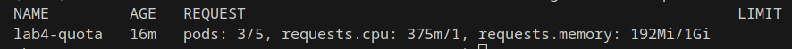

# Stworzenie przestrzeni nazw

Aby stworzyć przestrzeń nazw z limitami najpierw musimy stworzyć przestrzeń nazw.

```bash
kubectl create namespace lab4
```

Następnie należy stworzyć obiekt _ResourceQuota_ i dodać go do przestrzeni nazw.

```yaml
apiVersion: v1
kind: ResourceQuota
metadata:
  name: lab4-quota
spec:
  hard:
    requests.cpu: 1000m
    requests.memory: 1Gi
    pods: "5"
```

Dzięki temu przestrzeń nazw _lab4_ będzie mieć ograniczenia 5 podów oraz łącznie 1000 millicore i 1 GiB RAM dostępnych jako limity zasobów.

```bash
kubectl apply -f lab4-namespace.yml -n lab4
```

# Deployment

Aby stworzyć deployment należy:

```yaml
apiVersion: apps/v1
kind: Deployment
metadata:
  creationTimestamp: null
  labels:
    app: restrictednginx
  name: restrictednginx
  namespace: lab4
spec:
  replicas: 3
  selector:
    matchLabels:
      app: restrictednginx
  strategy: {}
  template:
    metadata:
      creationTimestamp: null
      labels:
        app: restrictednginx
    spec:
      containers:
        - image: nginx
          name: nginx
          resources:
            requests:
              memory: "64Mi"
              cpu: "125m"
            limits:
              memory: "256Mi"
              cpu: "250m"
status: {}
```

```bash
kubectl apply -f restricrednginx-deploy.yml
```

# Weryfikacja

Aby zweryfikować poprawność limitów:

```bash
kubectl get pods -n lab4
```


```bash
kubectl get resourcequota -n lab4
```



W celu dalszej weryfkiacji:

```
kubectl describe pod restrictednginx-5dcd9dc88c-hnbc5 -n lab4
```

```yaml
Name:             restrictednginx-5dcd9dc88c-hnbc5
Namespace:        lab4
Priority:         0
Service Account:  default
Node:             minikube/192.168.49.2
Start Time:       Sat, 28 Oct 2023 13:46:32 +0200
Labels:           app=restrictednginx
                  pod-template-hash=5dcd9dc88c
Annotations:      <none>
Status:           Running
IP:               10.244.0.52
IPs:
  IP:           10.244.0.52
Controlled By:  ReplicaSet/restrictednginx-5dcd9dc88c
Containers:
  nginx:
    Container ID:   docker://00c234fe3bca1404b75be5d3fb6acf11833d69cc73e1dba7311c9dbe5e9d2a93
    Image:          nginx
    Image ID:       docker-pullable://nginx@sha256:add4792d930c25dd2abf2ef9ea79de578097a1c175a16ab25814332fe33622de
    Port:           <none>
    Host Port:      <none>
    State:          Running
      Started:      Sat, 28 Oct 2023 13:46:38 +0200
    Ready:          True
    Restart Count:  0
    Limits:
      cpu:     250m
      memory:  256Mi
    Requests:
      cpu:        125m
      memory:     64Mi
    Environment:  <none>
    Mounts:
      /var/run/secrets/kubernetes.io/serviceaccount from kube-api-access-sps59 (ro)
Conditions:
  Type              Status
  Initialized       True
  Ready             True
  ContainersReady   True
  PodScheduled      True
Volumes:
  kube-api-access-sps59:
    Type:                    Projected (a volume that contains injected data from multiple sources)
    TokenExpirationSeconds:  3607
    ConfigMapName:           kube-root-ca.crt
    ConfigMapOptional:       <nil>
    DownwardAPI:             true
QoS Class:                   Burstable
Node-Selectors:              <none>
Tolerations:                 node.kubernetes.io/not-ready:NoExecute op=Exists for 300s
                             node.kubernetes.io/unreachable:NoExecute op=Exists for 300s
Events:
  Type    Reason     Age   From               Message
  ----    ------     ----  ----               -------
  Normal  Scheduled  11m   default-scheduler  Successfully assigned lab4/restrictednginx-5dcd9dc88c-hnbc5 to minikube
  Normal  Pulling    11m   kubelet            Pulling image "nginx"
  Normal  Pulled     11m   kubelet            Successfully pulled image "nginx" in 1.671340658s (5.429831748s including waiting)
  Normal  Created    11m   kubelet            Created container nginx
  Normal  Started    11m   kubelet            Started container nginx
```

Z opisu wynika, że ten pod ma poprawnie ustawione limity oraz jest kontrolowany przez _ReplicaSet_.

```bash
kubectl describe deployment -n lab4
```

```yaml
Name:                   restrictednginx
Namespace:              lab4
CreationTimestamp:      Sat, 28 Oct 2023 13:46:32 +0200
Labels:                 app=restrictednginx
Annotations:            deployment.kubernetes.io/revision: 1
Selector:               app=restrictednginx
Replicas:               3 desired | 3 updated | 3 total | 3 available | 0 unavailable
StrategyType:           RollingUpdate
MinReadySeconds:        0
RollingUpdateStrategy:  25% max unavailable, 25% max surge
Pod Template:
  Labels:  app=restrictednginx
  Containers:
   nginx:
    Image:      nginx
    Port:       <none>
    Host Port:  <none>
    Limits:
      cpu:     250m
      memory:  256Mi
    Requests:
      cpu:        125m
      memory:     64Mi
    Environment:  <none>
    Mounts:       <none>
  Volumes:        <none>
Conditions:
  Type           Status  Reason
  ----           ------  ------
  Available      True    MinimumReplicasAvailable
  Progressing    True    NewReplicaSetAvailable
OldReplicaSets:  <none>
NewReplicaSet:   restrictednginx-5dcd9dc88c (3/3 replicas created)
Events:
  Type    Reason             Age   From                   Message
  ----    ------             ----  ----                   -------
  Normal  ScalingReplicaSet  23m   deployment-controller  Scaled up replica set restrictednginx-5dcd9dc88c to 3
```

Z opisu wynika, że deployment ma 3 działające repliki.
