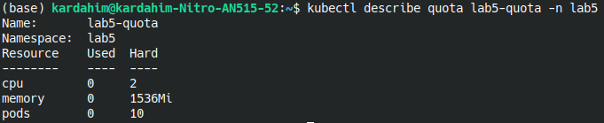
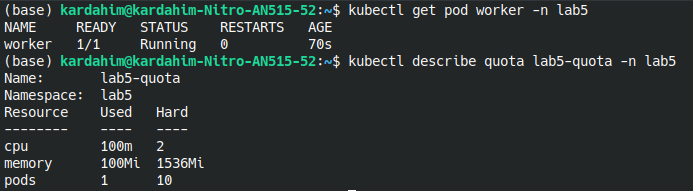
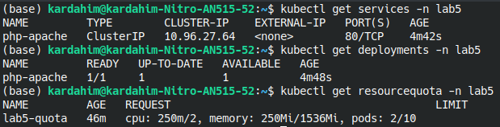
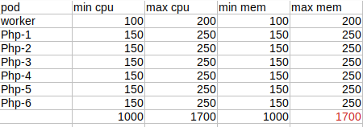
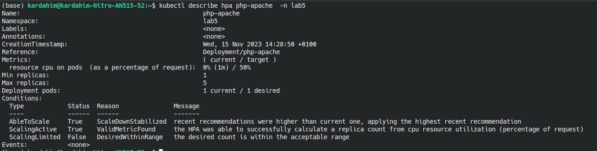
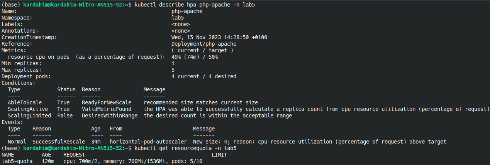

# Stworzenie przestrzeni nazw

```bash
kubectl create namespace lab5
```

# Stworzenie quoty


```bash
kubectl apply -f lab5-quota.yaml
```



# Stworzenie poda


```bash
kubectl apply -f worker.yaml
```



# Stworzenie deployment oraz service PHP-Apache


```bash
kubectl apply -f php-apache.yaml
```



# Użycie HPA

Maksymalna liczba replik jaka może być zastosowana w tej przestrzeni nazw to 5. Ponieważ gdy stworzylibyśmy 6 replik to w przypadku gdy worker oraz te repliki będą wykorzystywać maksymalne przydzielone zasoby to przekroczona zostanie dostępna liczba pamięci. Dalsze zwiększani/zmniejszanie liczby replik zależeć będzie od testów wydjaności.




```bash
kubectl apply -f php-apache-autoscaler.yaml
```



# Weryfikacja obciążenia

Aby wygenerować ruch na podach:

```bash
kubectl run -i --tty load-generator --rm --image=busybox:1.28 --restart=Never -- /bin/sh -c "while sleep 0.01; do wget -q -O- http://php-apache.lab5.svc.cluster.local; done"
```



Maksymalne obciążenie wygenerowane przez skrypt to 700m/2 dla cpu. Dodatkowo maksymalnie 4 repliki zostały wygenerowane. Można zostawić powyższą konfigurację.
